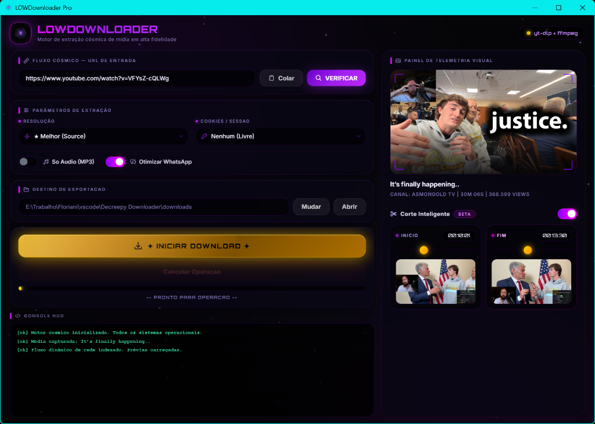

# 🌌 LOWDownloader

<p align="center">
  <br>
  <strong>A modern, minimalist, and cosmic desktop interface for high-performance video downloading, smart clipping, and post-processing.</strong>
</p>

<p align="center">
  
  
  
  
  <br><br>
  <a href="https://buymeacoffee.com/1b9hbqniv1" target="_blank">
    
  </a>
</p>

<p align="center">
  
</p>

---

## 🌟 What is LOWDownloader?

**LOWDownloader** is a tool built for content creators, video editors, and power users. It fuses the legendary robustness of the command-line utility `yt-dlp` with a **cutting-edge hardware-accelerated desktop UI (HTML5/CSS3/Tailwind)**.

Designed specifically to optimize video editing workflows, the application eliminates the need to download massive multi-hour videos just to extract a few minutes. Paste the link, see the metadata, choose your quality, mark the exact timestamps using interactive sliders with **real-time frame preview**, and download only the segment you need.

---

## ✨ Key Features

*   **🌌 Premium Cosmic Aesthetics**: An immersive visual style inspired by modern AAA game launchers (e.g., HoYoverse), featuring glassmorphic panels, glowing neon accents, smooth hover micro-animations, and an interactive particle canvas.
*   **✂️ Smart Clipping & Timestamp Scrubbing**:
    *   Set custom segments using range sliders or manual timestamp inputs (`HH:MM:SS`).
    *   Powered by FFmpeg, the app extracts and displays thumbnails of the selected start/end frames **without downloading the video first**.
    *   `yt-dlp` surgically downloads only the designated timeframe, saving gigabytes of data and hours of bandwidth.
*   **🍪 Secure Browser Cookie Integration**:
    *   Import authentication cookies from your favorite browser (Chrome, Firefox, Edge, Brave, Opera, Vivaldi, etc.) with a single click.
    *   Easily access private videos, subscriber-only streams (*sub-only* Twitch VODs), YouTube member-exclusive videos, or restricted social media content.
*   **📱 Instant WhatsApp Transcoding**:
    *   Optionally generate an optimized copy (`*_whatsapp.mp4`) encoded in H.264 Main Profile + AAC + yuv420p + 720p with faststart streaming.
    *   Fixes the dreaded *"unsupported file format"* error on WhatsApp caused by modern CODECs (such as AV1/VP9) or high-profile 1080p60fps Twitch streams.
*   **🎵 Audio-Only Extraction (MP3)**: Strip the video track and download only the audio from live broadcasts, podcasts, or music tracks with custom compression.
*   **📋 Live HUD Terminal & Debug Console**: An embedded scrolling console showcasing real-time download speeds, ETA, file sizes, and background process logs.
*   **🖱️ Smart Clipboard Detection**: Automatically grabs and fills in the video URL when a valid media link is copied to your clipboard.

---

## 🌐 Supported Sites

Leveraging the backend power of `yt-dlp`, LOWDownloader supports **hundreds of platforms** out of the box, including:

*   **Twitch** (Public VODs, Clips, subscriber-only streams via cookies).
*   **YouTube** (Videos, Shorts, finished Streams, ongoing Lives, member-only videos).
*   **Facebook** (Watch, Reels, Page videos, private groups via cookies).
*   **Instagram & TikTok** (Reels, video posts, full HD media).
*   **Twitter / X** (Broadcasts, recorded Spaces, tweets containing video).
*   *Kick, Vimeo, Streamable, Dailymotion, Soundcloud, and many more.*

---

## 🛠️ Quick Installation (1-Time Setup)

The application is lightweight and runs directly on your local machine.

1.  Make sure you have **[Python 3.8+](https://www.python.org/downloads/)** installed and that you checked the **"Add Python to PATH"** option during installation.
2.  Double-click the **`setup.bat`** script.

The script will automatically:
*   Verify Python's configuration on your system.
*   Install or update the latest stable version of `yt-dlp`.
*   Install crucial dependencies: `pywebview` for the hardware-accelerated frontend, `pillow` for image rendering, and `imageio-ffmpeg` (which fetches a stable, compact build of `ffmpeg.exe` at ~30MB).

> 💡 **Custom FFmpeg:** If you prefer using your own system-wide FFmpeg binary, place your `ffmpeg.exe` inside the `bin/` folder at the project's root. LOWDownloader will prioritize this file over any package-installed fallback.

---

## 🚀 How to Run

1.  Launch the app by double-clicking **`LOWDownloader.bat`**.
2.  **Paste & Verify**: Paste a media URL and click **Verificar** (Verify). The app fetches the title, author, duration, and main thumbnail instantly.
3.  **Configure**:
    *   Choose your preferred **Quality** (select *Source* to download the original file without transcoding).
    *   *(Optional)* Toggle **Cortar trecho** (Clip segment) to define custom start and end points.
    *   *(Optional)* Check **Somente áudio (MP3)** to fetch the audio track only.
    *   *(Optional)* Check **Otimizar p/ WhatsApp** to transcode it into a WhatsApp-friendly format.
    *   *(Optional)* If the content requires logging in, select your browser in the **Cookies** dropdown. *(Remember to close active browser tabs containing the site or close the browser completely so the application can read the cookie database database lock free).*
4.  Specify your destination folder (defaults to the `downloads/` folder in the project root).
5.  Click **BAIXAR** (Download) and watch the progress bar and real-time logs fly by!

---

## 📁 Project Structure

```text
LOWDownloader/
├── .cache/                    # Temporary caching directory for thumbnails and previews
├── bin/                       # Local binaries folder (for custom ffmpeg.exe, ffprobe.exe)
├── downloads/                 # Default destination directory for downloaded media
├── LOWDownloader.bat          # Main launcher (runs the app without opening an annoying console window)
├── lowdownloader.pyw          # Primary Python script running the webview desktop app
├── lowdownloader_logo.png     # Official high-resolution flat PNG logo
├── lowdownloader_logo.ico     # Multi-resolution native Windows icon
├── requirements.txt           # Python library dependencies list
├── README.md                  # Comprehensive English documentation
└── setup.bat                  # Automated environment setup script
```

---

## 🔧 Keeping Things Updated

Platforms like YouTube and Twitch change their media delivery mechanisms regularly. If downloads begin to fail or behave unexpectedly, simply **run the `setup.bat` script again**. It will pull the latest updates for `yt-dlp` and re-optimize your environment.

---

## ☕ Support the Project

If this tool has saved you hours of editing, rendering, or downloading, consider buying me a coffee to support continued development and updates!

<p align="center">
  <a href="https://buymeacoffee.com/1b9hbqniv1" target="_blank">
    
  </a>
</p>

---

## 📜 Licenses & Technologies

LOWDownloader is built on top of high-integrity, battle-tested open-source libraries:
*   [yt-dlp](https://github.com/yt-dlp/yt-dlp) - UNLICENSE.
*   [PyWebView](https://github.com/r0x8f/pywebview) - Hardware-accelerated UI integrated via Windows WebView2.
*   [FFmpeg](https://ffmpeg.org/) - Universal multimedia framework.
*   Tailwind CSS / Inter Font - Modern high-fidelity visuals.

---
*Crafted for premium aesthetics, ultimate speed, and absolute convenience.*
